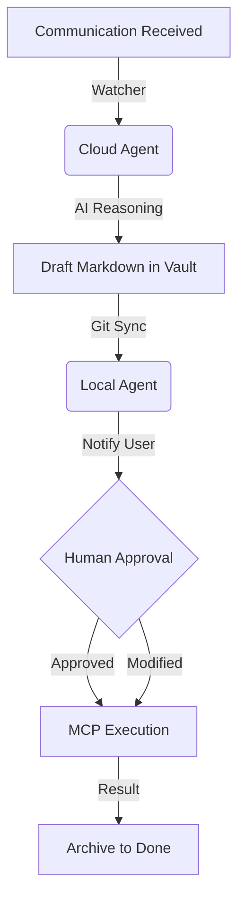

# Abdullah Junior: The Elite Digital FTE (Full-Time Equivalent)

**"Your life and business on autopilot. Self-evolving, Cloud-native, and Secure."**

Abdullah Junior is a high-autonomy AI agent system designed to act as a comprehensive Digital Employee. It proactively manages personal and business affairs 24/7 using a sophisticated multi-agent architecture that combines the reliability of cloud monitoring with the security of local execution.

---

## 🏗 System Architecture & Design

The system is built on a **Dual-Agent Architecture** to balance 24/7 availability with absolute security.

### 1. Cloud Agent (The "Sentry")
*   **Role:** Continuous Monitoring & Draft Generation.
*   **Permissions:** Read-only access to communications; No access to financial credentials or high-stakes writing.
*   **Workflow:** Watches Gmail, WhatsApp, and LinkedIn. When a trigger is detected (e.g., an inquiry), it uses AI to draft a response or task and saves it to the synchronized Vault.
*   **Source:** `src/cloud_agent.py`

### 2. Local Agent (The "Executive")
*   **Role:** Secure Execution & Approval Management.
*   **Permissions:** Full access to Odoo (Accounting), Social Media APIs (Posting), and sensitive local files.
*   **Workflow:** Syncs with the Cloud Agent's drafts. It notifies the user for approval and then executes the action using its local MCP servers.
*   **Source:** `src/local_agent.py`

### 3. The Orchestrator
*   **Role:** The "Brain" of the system.
*   **Logic:** Classifies tasks, selects the most efficient AI model (Gemini 1.5 Pro, Claude 3.5, etc.), and coordinates between different MCP servers to fulfill complex requests.
*   **Source:** `src/orchestrator.py`

---

## 🎨 Design & Workflow (The "Digital FTE Loop")

The system operates through a Git-synced **Obsidian Vault**, acting as its central nervous system.



### Step-by-Step Working:
1.  **Detection:** Watchers poll Gmail (IMAP), WhatsApp (Web), and LinkedIn (API) every 60 seconds.
2.  **Contextualization:** The Cloud Agent pulls the relevant history from the Vault to understand the relationship with the sender.
3.  **Drafting:** A proposal is written into `Vault/Needs_Action/` containing the suggested reply and any technical steps (e.g., "Create invoice for $500").
4.  **Review:** You open Obsidian on your phone or laptop to see the draft.
5.  **Execution:** The Local Agent detects your approval and performs the actual API calls.

---

## 📂 Vault: The Knowledge Base

Your Obsidian Vault is organized by task state:

| Folder | Description |
| :--- | :--- |
| `Needs_Action/` | New triggers awaiting the agent's initial draft. |
| `Pending_Approval/` | Drafted tasks waiting for your "OK" to execute. |
| `In_Progress/` | Tasks currently being processed by the Local Agent. |
| `Done/` | Perpetual archive of every interaction and action taken. |
| `Logs/Audit/` | JSONL logs of every tool call, model prompt, and response. |
| `Plans/` | Long-term strategic goal breakdowns (e.g., "Launch Q1 Campaign"). |

---

## 🔌 Core Integrations (MCP Servers)

Abdullah Junior uses **Model Context Protocol (MCP)** to interact with specialized services:

### 🏢 Odoo (Business Accounting)
*   **Module:** `src/mcp_servers/odoo_server.py`
*   **Tools:** 
    *   `create_customer_invoice`: Generates professional PDFs and sends them to clients.
    *   `record_vendor_bill`: Automatically extracts data from email receipts and logs expenses.
    *   `get_financial_summary`: Provides real-time Revenue/Expense/Margin reports.
    *   `list_products`: Searches your inventory for pricing and availability.

### 📧 Gmail (Official API)
*   **Module:** `src/watchers/gmail_watcher.py` & `src/integrations/email_categorizer.py`
*   **Features:** Intelligent spam filtering, automatic labeling, and drafting context-aware replies.
*   **Privacy:** Ignores any thread with the `NO_AI` label.

### 📱 Social Media Empire
*   **Meta (Facebook & Instagram):** `src/mcp_servers/meta_social_connector.py`
    *   Post updates with images/links.
    *   Fetch engagement analytics (likes, shares, reach).
    *   Automated hashtag generation based on image content.
*   **Twitter/X:** `src/mcp_servers/twitter_connector.py`
    *   Post single tweets or complex 10+ tweet threads.
    *   Monitor mentions and auto-draft engagement replies.
    *   Fetch profile performance metrics.

---

## 🌟 Self-Evolution Engine

This project features the **World's First Self-Evolving AI Employee**. 
- **Autonomous Debugging:** If a script fails, the Guardian system captures the traceback and asks the AI to write a patch.
- **Skill Acquisition:** The system can "study" its own `src/` directory to understand how to write new MCP connectors.
- **Performance Tuning:** Analyzes `Vault/Logs/` to identify which AI models are most cost-effective for specific task types.

---

## 🧪 Testing & Validation

We maintain a strict testing protocol to ensure your business stays online:

| Test Type | Command | Description |
| :--- | :--- | :--- |
| **Full Suite** | `pytest tests/` | Runs all unit and integration tests. |
| **Odoo Sync** | `pytest tests/test_odoo_integration.py` | Verifies XML-RPC connection and invoice creation. |
| **Social Media** | `pytest tests/test_social_media_apis.py` | Validates Meta and Twitter API tokens. |
| **E2E Gold** | `pytest tests/e2e_gold_phase_test.py` | Simulates a full Gmail -> Odoo -> WhatsApp flow. |

---

## 🚀 Deployment & Setup

### 1. Environment Configuration
Create a `config/.env` file with the following:
*   `ODOO_URL`, `ODOO_USERNAME`, `ODOO_PASSWORD`
*   `FACEBOOK_PAGE_ID`, `INSTAGRAM_ACCOUNT_ID`, `META_ACCESS_TOKEN`
*   `TWITTER_API_KEY`, `TWITTER_API_SECRET`, `TWITTER_BEARER_TOKEN`
*   `GMAIL_CLIENT_ID`, `GMAIL_CLIENT_SECRET`

### 2. Execution
```bash
# Start the local environment
python src/local_agent.py

# Start the background watchers
python src/service_manager.py
```

*Built for the 2026 AI Employee Hackathon. Autonomous. Secure. Robust.*
