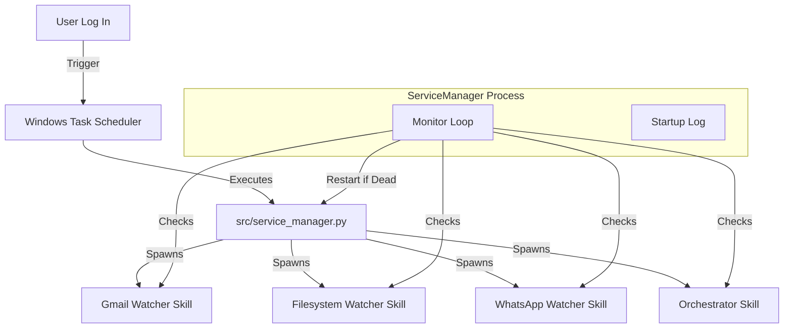

# Implementation Plan: Laptop Startup

## 1. Architecture

## 2. Design Decisions

- **Centralized Manager**: A single python script manages all sub-services. This simplifies the Task Scheduler entry (only one task needed).
- **Skill Wrappers**: Services are started via their Skill `run.py` scripts to ensure environment consistency.
- **Logon Trigger**: We use "AtLogon" to ensure the user's desktop session is active (required for Playwright/Browser automation).

## 3. Implementation Steps

### Step 1: Verification of Existing Scripts
- Validate `src/service_manager.py` against Functional Requirements.
- Validate `scripts/install_service.ps1` paths and permissions.

### Step 2: Test Suite Creation
- Create `tests/test_startup.py` or `tests/verify_startup.ps1` to:
  - Check if `DigitalFTE_ServiceManager` task exists.
  - Check if `startup_log.md` is created and writable.
  - Simulate a crash (kill a child process) and verify restart (Integration Test).

### Step 3: Refinement (If needed)
- Ensure `service_manager.py` handles "environment not found" gracefully.
- Add specific checks for `node_modules` or `venv` if missing.

## 4. Rollout
- User runs `scripts/install_service.ps1` once.
- System operates autonomously thereafter.
