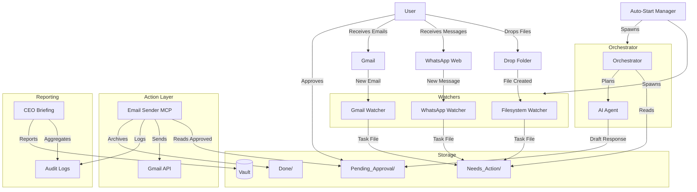

# Implementation Plan: Silver Tier Upgrade

**Feature Branch**: `001-silver-tier-upgrade`
**Created**: 2026-01-15
**Updated**: 2026-01-22
**Status**: Implementation Complete - Polishing Phase

## 1. Architecture Overview



## 2. Component Architecture

### 2.1 WhatsApp Watcher (`src/watchers/whatsapp_watcher.py`)

**Technology**: Playwright (Chromium with persistent context)

**Key Design Decisions**:
- **Persistent Browser Context**: Stores WhatsApp Web session to avoid daily QR scan
- **Polling Architecture**: Scans for unread messages every 30 seconds (configurable)
- **Dual Mode**: Perception (reading) + Action (sending) in single watcher
- **Priority Detection**: Keyword-based priority assignment (urgent, high, medium, low)
- **Contact Integration**: Checks known contacts for trust-based routing

**Critical Paths**:
1. Authentication Check → Unread Message Detection → Task Creation
2. Outbox Processing → Message Sending → Status Logging

**Error Handling**:
- Session expiration → Creates ALERT task in Needs_Action
- Selector failures → Logs warning, continues operation
- Send failures → Keeps message in queue, logs error

**Rate Limiting**: None (perception only)

**Dependencies**:
- `playwright` library
- `src/utils/contacts.py` for known contact checking
- WhatsApp Web session (requires manual QR scan on first run)

### 2.2 Filesystem Watcher (`src/watchers/filesystem_watcher.py`)

**Technology**: Watchdog (File System Events)

**Key Design Decisions**:
- **Event-Driven**: Responds to `FileCreatedEvent` immediately
- **Debouncing**: 5-second wait to ensure file write completion
- **Type-Based Actions**: Suggests actions based on file extension
- **Ignore Patterns**: Filters temp files, hidden files, OS metadata
- **Rate Limiting**: Max 50 files/hour to prevent overwhelming system

**Critical Paths**:
1. File Created Event → Debounce Wait → Metadata Extraction → Task Creation

**Error Handling**:
- File locked/incomplete → Skips processing, logs debug message
- File deleted during processing → Skips gracefully
- Metadata extraction failure → Creates task with minimal info

**Rate Limiting**: 50 tasks/hour (configurable)

**Dependencies**:
- `watchdog` library
- Configurable watch folder (default: `DropFolder/`)

### 2.3 Email Sender MCP (`src/mcp_servers/email_sender.py`)

**Technology**: FastMCP + Gmail API

**Key Design Decisions**:
- **MCP Interface**: Exposes tools for Claude to call
- **Approval Workflow**: Platinum rule - cloud agents always require approval
- **Rate Limiting**: 10 emails/hour, 100 emails/day (hard limits)
- **Audit Logging**: Every send attempt logged with outcome
- **Template Support**: Jinja2 templates for common email types

**Critical Paths**:
1. Tool Invocation → Approval Check → Rate Limit Check → Gmail API → Audit Log
2. Template Rendering → Variable Substitution → Send Logic

**Error Handling**:
- Rate limit exceeded → Returns error, logs to audit
- Gmail API failure → Retry with exponential backoff (via utility)
- Missing credentials → Graceful failure with clear error message

**Rate Limiting**:
- 10 emails/hour
- 100 emails/day
- Max 5 recipients per email

**Dependencies**:
- `fastmcp` library
- `src/utils/google_auth.py` for Gmail API
- `src/utils/audit_logger.py` for centralized audit trail
- `src/utils/error_recovery.py` for retry logic

### 2.4 CEO Briefing (`src/reports/ceo_briefing.py`)

**Technology**: Python script with AI agent integration

**Key Design Decisions**:
- **Log Aggregation**: Reads all daily log files for past 7 days
- **AI-Generated Narrative**: Uses AI agent to create executive summary
- **Financial Integration**: Fetches data from Odoo MCP server
- **ROI Calculation**: Estimates dollar value of time saved
- **Scheduled Execution**: Designed for Task Scheduler (Monday 8 AM)

**Critical Paths**:
1. Date Range Calculation → Log File Loading → Data Analysis → Report Generation
2. AI Agent Invocation → Narrative Generation → Report Formatting

**Error Handling**:
- Missing log files → Processes available logs, notes gaps
- Odoo unavailable → Shows "Financial data unavailable" message
- AI agent failure → Falls back to data-only report

**Rate Limiting**: None (internal report)

**Dependencies**:
- `src/utils/ai_agent.py` for narrative generation
- `src/mcp_servers/odoo_server.py` for financial data (optional)
- Daily JSON log files in `Vault/Logs/`

### 2.5 Auto-Start (`scripts/startup/install_autostart.ps1`)

**Technology**: Windows Task Scheduler + Service Manager

**Key Design Decisions**:
- **Single Task**: One scheduled task spawns all components
- **Logon Trigger**: Starts when user logs in (required for browser automation)
- **Service Manager**: Central process (`src/service_manager.py`) manages children
- **Health Monitoring**: Checks child processes, restarts if crashed
- **Startup Log**: Creates `Vault/Logs/startup_log.md` for diagnostics

**Critical Paths**:
1. User Login → Task Scheduler Trigger → Service Manager Start → Spawn All Watchers

**Error Handling**:
- Component fails to start → Logs error, continues with others
- Component crashes during runtime → Auto-restart (configurable)
- Environment issues → Logs detailed error for troubleshooting

**Rate Limiting**: None

**Dependencies**:
- Windows Task Scheduler
- PowerShell (for installation)
- Python environment with all required packages

## 3. Data Flow

### 3.1 Perception Pipeline (Inbound)

```
External Event → Watcher Detection → Task File Creation → Vault/Needs_Action/
```

**Task File Format** (Markdown with YAML frontmatter):
```markdown
---
type: [gmail|whatsapp|file]
source: [sender|chat_name|filename]
priority: [urgent|high|medium|low]
created: [ISO-8601 timestamp]
---

# [Priority Emoji] [Source Type]: [Subject/Name]

## Metadata
- **Source:** [Gmail|WhatsApp|Filesystem]
- **From:** [Sender/Chat/Path]
- **Priority:** [URGENT|HIGH|MEDIUM|LOW]

## Content
[Message/File details]

## Suggested Actions
- [ ] [Action 1]
- [ ] [Action 2]
```

### 3.2 Action Pipeline (Outbound)

```
Orchestrator → AI Agent → Draft → Pending_Approval/ → User Approval → Email MCP → Gmail API → Done/
```

**Approval File Format**:
```markdown
---
type: email_approval
status: pending
created: [ISO-8601 timestamp]
to: [recipient]
subject: [subject line]
---

# Email Approval Request

**To:** [recipient]
**Subject:** [subject]

## Body
[email body]

---
To approve, move this file to `Vault/Approved/`.
```

### 3.3 Reporting Pipeline

```
Daily Logs → CEO Briefing Script → AI Narrative → Report Markdown → Vault/
```

## 4. Security & Compliance

### 4.1 Authentication & Authorization

- **Gmail API**: OAuth 2.0 with refresh tokens, scopes: `gmail.readonly`, `gmail.send`
- **WhatsApp Web**: Browser session persistence (no API key)
- **Known Contacts**: Whitelist-based trust model for auto-processing

### 4.2 Data Protection

- **Credentials**: Stored in `config/` (gitignored), never hardcoded
- **PII Redaction**: Phone numbers redacted in logs
- **Audit Trail**: All actions logged with timestamp, actor, outcome

### 4.3 Rate Limiting

| Component | Limit | Enforcement |
|-----------|-------|-------------|
| Email Sender | 10/hour, 100/day | Pre-check in tool |
| Filesystem Watcher | 50/hour | Task history tracking |
| WhatsApp Watcher | None | Passive perception only |

### 4.4 Approval Workflow

- **Cloud Agents**: MUST use approval workflow (enforced via `FTE_ROLE` env var)
- **Local Agents**: CAN bypass approval for known contacts (opt-in)
- **High-Risk Actions**: Always require approval (new recipients, bulk emails)

## 5. Testing Strategy

### 5.1 Unit Tests

- **Filesystem Watcher**: Mock file creation events, verify task files
- **Email Sender**: Mock Gmail API, verify rate limiting, audit logging
- **WhatsApp Watcher**: Mock Playwright page, verify message parsing
- **CEO Briefing**: Mock log files, verify aggregation logic

### 5.2 Integration Tests

- **End-to-End Perception**: Drop real file → Verify task file created
- **End-to-End Action**: Create approval file → Verify email sent
- **Auto-Start**: Simulate login → Verify all watchers start

### 5.3 Acceptance Tests

Refer to [spec.md](./spec.md) User Stories 1-5 for detailed acceptance scenarios.

## 6. Deployment

### 6.1 Prerequisites

- Windows 10/11 with Task Scheduler
- Python 3.8+ with required packages (see `requirements.txt`)
- Gmail API credentials configured (`config/credentials.json`)
- WhatsApp Web access (for QR scan)

### 6.2 Installation Steps

1. **Install Dependencies**: `pip install -r requirements.txt`
2. **Configure Environment**: Copy `.env.example` to `.env`, fill values
3. **Authenticate Services**:
   - Run `src/utils/google_auth.py` to get Gmail tokens
   - Run `src/watchers/whatsapp_watcher.py` once to scan QR code
4. **Install Auto-Start**: Run `scripts/startup/install_autostart.ps1` as admin
5. **Verify**: Check `Vault/Logs/startup_log.md` after next login

### 6.3 Configuration

**Environment Variables** (`.env`):
```bash
# WhatsApp
WHATSAPP_POLL_INTERVAL=30
WHATSAPP_HEADLESS=false
WHATSAPP_AUTO_REPLY=false

# Filesystem
WATCH_FOLDER=./DropFolder
FILE_DEBOUNCE=5

# Email
MAX_HOURLY=10
MAX_DAILY=100

# CEO Briefing
BRIEFING_DAYS=7

# Global
DRY_RUN=false
FTE_ROLE=local
```

## 7. Rollout Plan

### Phase 1: Silent Testing (Week 1)
- Run watchers manually, verify task files created
- Test email sender with approval workflow
- Generate first CEO briefing

### Phase 2: Auto-Start Activation (Week 2)
- Install Task Scheduler entry
- Monitor startup logs for failures
- Verify all components start reliably

### Phase 3: Production Operation (Week 3+)
- Enable auto-reply for known contacts (WhatsApp)
- Reduce approval requirements for trusted senders
- Schedule CEO briefing for Monday 8 AM

## 8. Success Metrics

| Metric | Target | Measurement |
|--------|--------|-------------|
| Detection Latency | < 60s | WhatsApp/Gmail from receipt to task file |
| File Processing | < 30s | Filesystem from drop to task file |
| Email Send | < 10s | From approval to sent |
| Briefing Generation | < 8:15 AM | Monday delivery time |
| Startup Time | < 2 min | All watchers running after login |
| Uptime | 99% | Business hours (8 AM - 6 PM) |
| HITL Compliance | 100% | No unapproved emails sent |

## 9. Monitoring & Observability

### 9.1 Logs

- **Daily JSON Logs**: `Vault/Logs/YYYY-MM-DD.json`
- **Startup Log**: `Vault/Logs/startup_log.md`
- **Audit Trail**: `Vault/Logs/audit/audit_YYYY-MM-DD.jsonl`
- **Email Audit**: `Vault/Logs/email_audit_log.md`

### 9.2 Health Checks

- **Alert Tasks**: Watchers create `ALERT_*.md` in Needs_Action on critical failures
- **CEO Briefing**: Weekly summary includes error count and system health
- **Startup Log**: Shows which components started successfully

### 9.3 Debugging

- **Enable Verbose Logging**: Set `LOG_LEVEL=DEBUG` in `.env`
- **Dry Run Mode**: Set `DRY_RUN=true` to test without side effects
- **WhatsApp Headless**: Set `WHATSAPP_HEADLESS=false` to see browser UI

## 10. Known Limitations

- **WhatsApp Message Content**: Limited to preview text from chat list (full message requires opening chat)
- **File Type Support**: No OCR or deep content extraction (metadata only)
- **Multi-User**: Single-user system (one Windows account)
- **Cloud Deployment**: Not supported in Silver tier (local laptop only)
- **Real-Time Notifications**: No push notifications to mobile

## 11. Future Enhancements (Gold Tier)

- WhatsApp message replies (bi-directional)
- OCR for scanned documents
- Multi-user support
- Cloud deployment option
- Real-time push notifications
- Advanced AI agent capabilities

## 12. Architectural Decisions

See Architecture Decision Records (ADRs) for detailed rationale:
- ADR-001: Polling vs WebSockets for WhatsApp
- ADR-002: MCP vs Direct Integration for Email Sender
- ADR-003: Task Scheduler vs Windows Service for Auto-Start
- ADR-004: Markdown vs Database for Task Storage

---

**Status**: ✅ Implementation Complete - Polish Phase (2026-01-22)

**Next Steps**:
1. Final bug fixes and improvements
2. Comprehensive testing
3. Documentation updates
4. User acceptance testing
