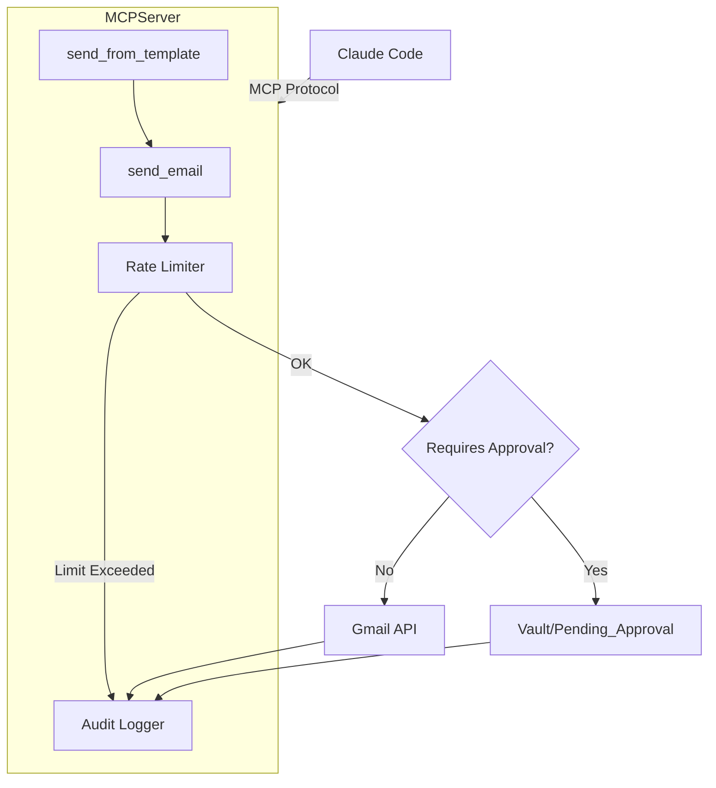

# Implementation Plan: Email Sender MCP

## 1. Architecture

## 2. Implementation Steps

### Step 1: Gap Closure
- Modify `src/mcp_servers/email_sender.py`:
  - Update `send_email` to check `len(to) + len(cc) + len(bcc) <= 5`.
  - Ensure `send_from_template` validates that `subject` is present in variables.

### Step 2: Verification
- Create `tests/test_email_mcp.py` to verify:
  - Rate limiting logic (mocking the log file).
  - Recipient limit enforcement.
  - Template rendering.
  - Approval file creation.

### Step 3: Deployment
- Ensure `config/credentials.json` and `config/token_email.json` are present (User task).
- Register MCP server in `claude_mcp_config.json` (if not already).

## 3. Configuration
- **Rate Limits**: 10/hour, 100/day.
- **Max Recipients**: 5 per email.
